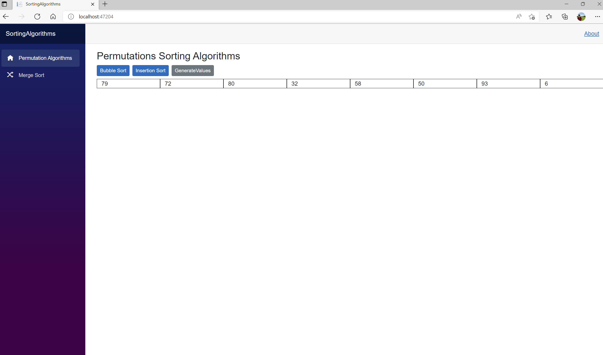
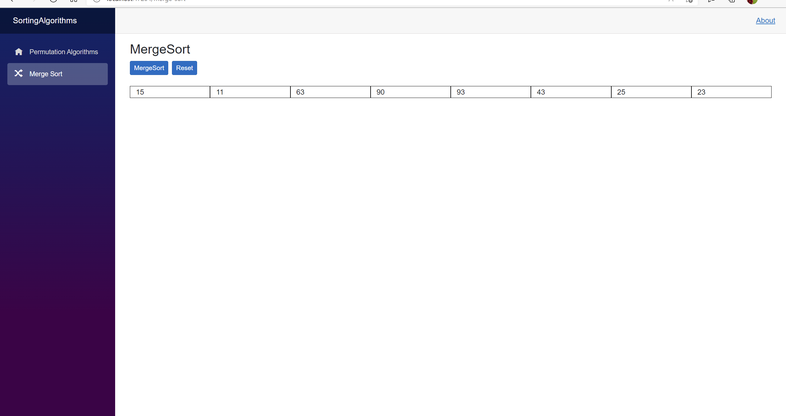

# Blazor Server App showing sorting algorithms in action

1. BubbleSort; InsertionSort.

__Buttons:__ 
 - _Bubble Sort_ - Sort array with bubble sort;
 - _Insertion Sort_ - Sort array with insertion sort;
 - _Generate Values_ - Generate new values; 

2. MergeSort

__Buttons:__
- MergeSort - Sort array with merge sort;
- Reset - reset values in an array;

 